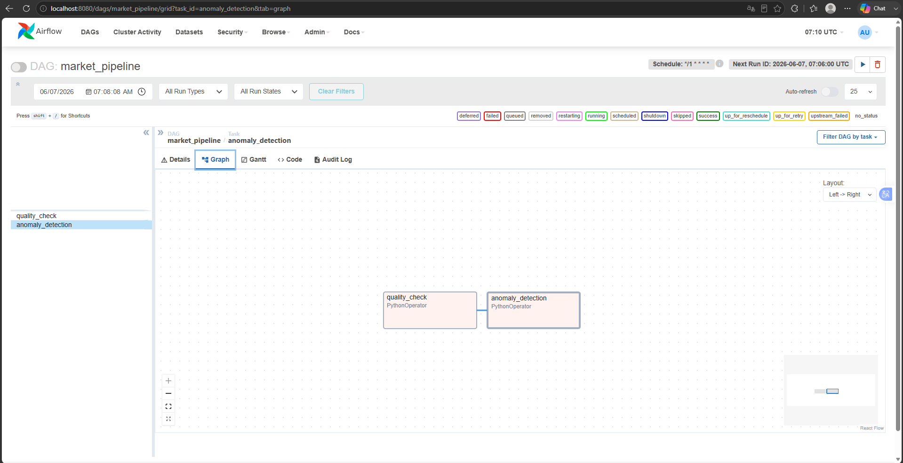
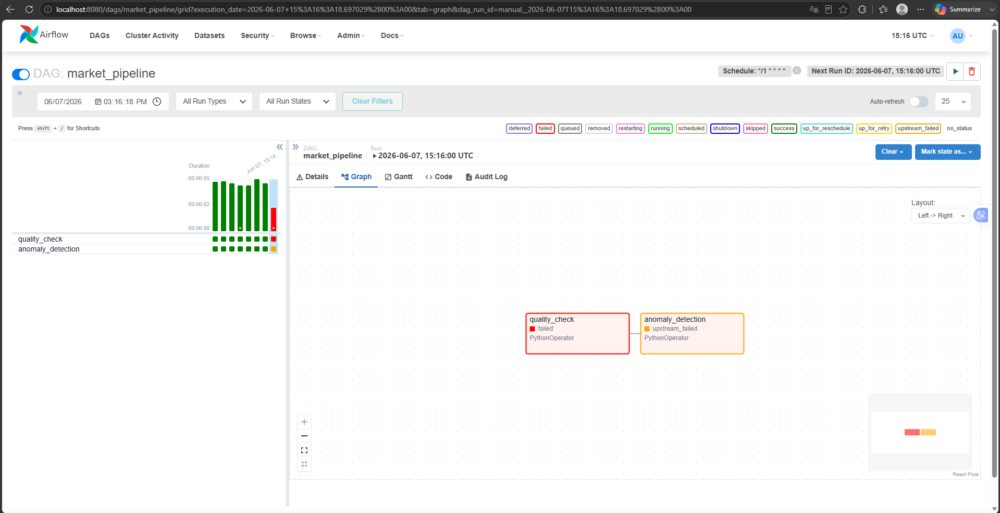
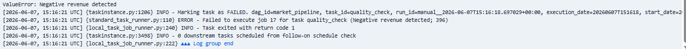
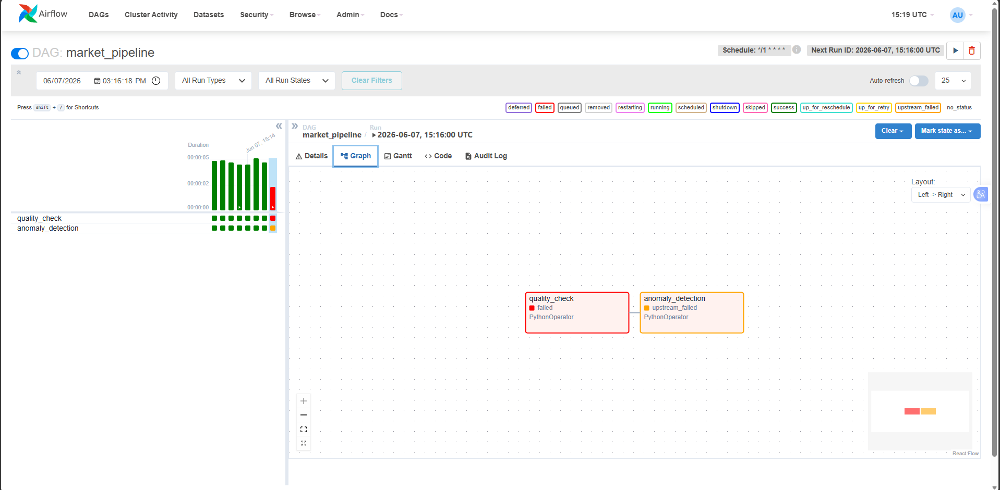
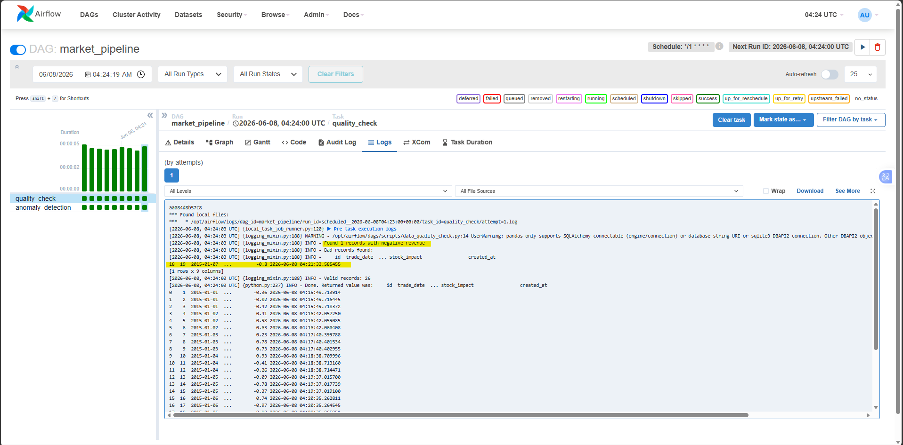
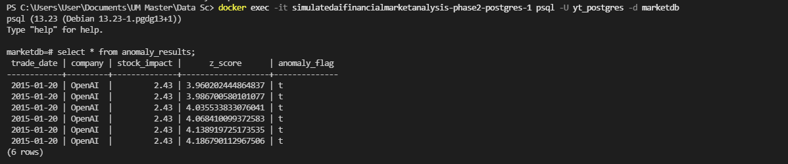

# AI Financial Market Analysis (Phase 2)

## Project Description (Phase 2)
Phase 2 extends the real-time streaming pipeline built in Phase 1 by introducing **workflow orchestration, data quality validation, and anomaly detection** using Apache Airflow.

This phase focuses on improving pipeline reliability, automation, and data trustworthiness before data is stored and used for downstream analytics.

## Project Objectives (Phase 2)
- Orchestrate data pipeline using Apache Airflow
- Implement scheduled and near real-time processing workflows
- Perform data quality checks on incoming financial data
- Detect anomalies in market behavior
- Improve pipeline reliability and observability

## Technologies Used (Phase 2)
- **Apache Airflow** → Workflow orchestration and scheduling
- **Python** → Data processing and anomaly detection
- **Kafka (Phase 1)** → Streaming data ingestion layer
- **PostgreSQL (Phase 1)** → Data storage layer
- **Pandas / NumPy** → Data validation and analysis
- **Docker** → Containerized environment for reproducibility

## Project Workflow (Phase 2)
Kafka
  ↓
PostgreSQL (raw market_data)
  ↓
Airflow DAG
  ├── Data Quality Check
  ├── Anomaly Detection
  └── Store Results (PostgreSQL)

## Key Components (Phase 2)

### 1. Apache Airflow Orchestration
- Schedules and manages pipeline execution
- Defines task dependencies (ETL workflow)
- Ensures reliable and automated data processing

### 2. Data Quality Checks
- Missing value detection
- Schema validation (column integrity)
- Data type validation
- Business rule validation (e.g., revenue ≥ 0)

### 3. Anomaly Detection
- Detects unusual stock impact values
- Identifies abnormal revenue growth patterns
- Flags outliers using statistical methods (e.g., Z-score)

## Example Checks Implemented (Phase 2)
- Null value detection
- Column existence validation
- Range validation for financial metrics
- Outlier detection using statistical thresholds

## Key Learning Outcomes (Phase 2)
- Built workflow orchestration using Apache Airflow
- Understood ETL scheduling and task dependencies
- Implemented data quality validation techniques
- Applied basic anomaly detection methods
- Improved pipeline reliability and observability

## Future Enhancements (Phase 3)
- Real-time dashboard using Metabase / Superset
- Advanced ML-based anomaly detection
- Alerting system (email / Slack notifications)
- Data lake integration (S3 / MinIO)
- Scalable processing using Apache Spark

## Appendix
- **Phase 1:** CSV → Kafka → PostgreSQL streaming pipeline
- **Phase 2:** Airflow orchestration + data validation + anomaly detection

_Airflow successfully schedule data quality check and anomaly detection_

_DAG is running market pipeline, the eight data is failed at quality check as the revenue is a negative value_

_This causes downstream anomalies detection function failed_

_By observing quality check task logs, one bad record found, airflow skipped the bad record_

_Extract anomalies data_