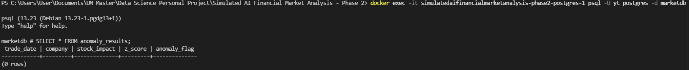

# Simulated AI Financial Market Real-Time Monitoring & Anomaly Detection Platform

## Project Objectives
Develop a real-time analytics platform that monitors AI company financial indicators, detects abnormal market behavior, generates automated alerts, and visualizes insights through interactive dashboards.

## Project Architecture

## Appendix

_Real-time dashboard that automatically refreshed every 5 minutes_

_Automatic alert sent to email_